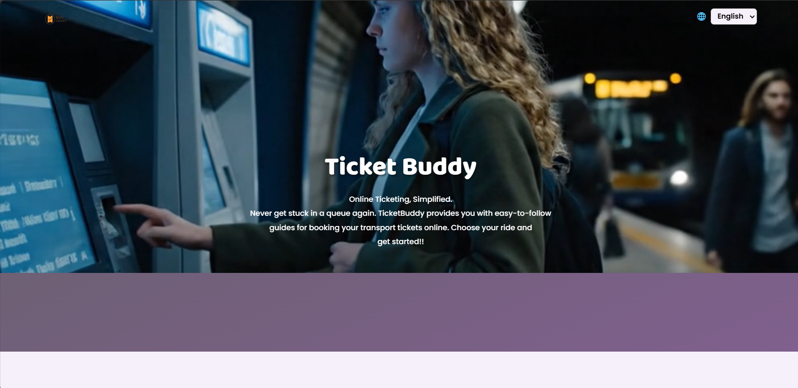
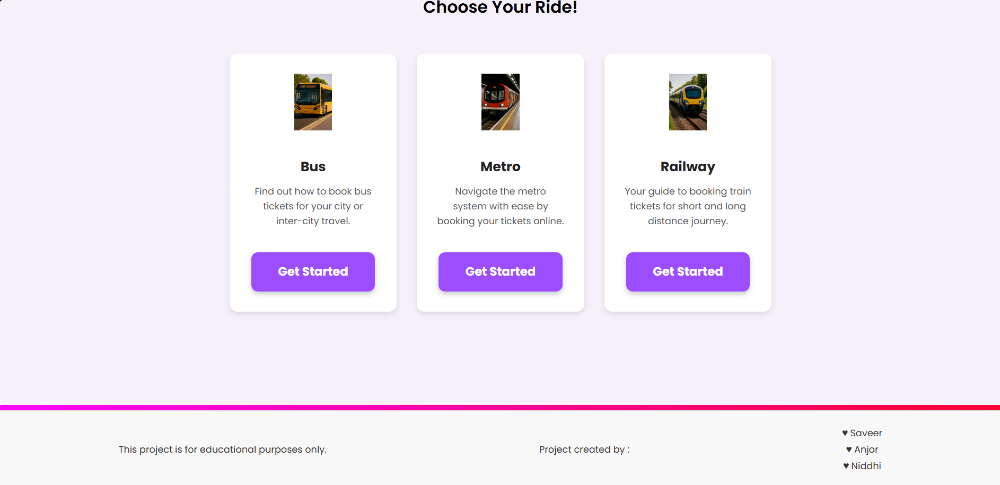

# 🎟️ Ticket Buddy

**Online Ticketing, Simplified.**

Ticket Buddy is a static website designed to provide easy-to-follow guides for booking various transport tickets online. This project is created for educational purposes to demonstrate modern web development practices using HTML, CSS, and JavaScript.

---

## ✨ Features

- **Responsive Design:** The website is fully responsive and works beautifully on all devices, from mobile phones to desktops.
- **Interactive Guides:** Provides detailed, step-by-step guides for booking bus, metro, and railway tickets.
- **Language Switcher:** A simple, functional language selector to switch between different language versions of the site.
- **Clean & Modern UI:** A sleek and intuitive user interface built with custom CSS.
- **Background Video:** An engaging background video on the hero section to enhance the user experience.

---

## 🛠️ Technologies Used

- **HTML5:** For the core structure of the website.
- **CSS3:** For styling and creating the responsive layout.
- **JavaScript:** For the interactive functionality, such as the language switcher.
- **Poppins & Baloo Bhai 2 Fonts:** Imported from Google Fonts to give the site a friendly and modern look.

---

## Some Images!!




---

## 🚀 How to Run Locally

To view and run this project on your local machine, follow these simple steps:

1.  **Clone the Repository:**
    If this project is on GitHub, use the following command to clone it. Replace `<repository-url>` with the actual URL.
    ```bash
    git clone <repository-url>
    ```

2.  **Open the Project:**
    Navigate to the project directory.
    ```bash
    cd ticket-buddy
    ```

3.  **Launch the `index.html` file:**
    Simply open the `index.html` file in your preferred web browser. You can do this by double-clicking the file or by using your browser's "Open file" option.

---

## 📄 File Structure

The project follows a clean and logical file structure:
